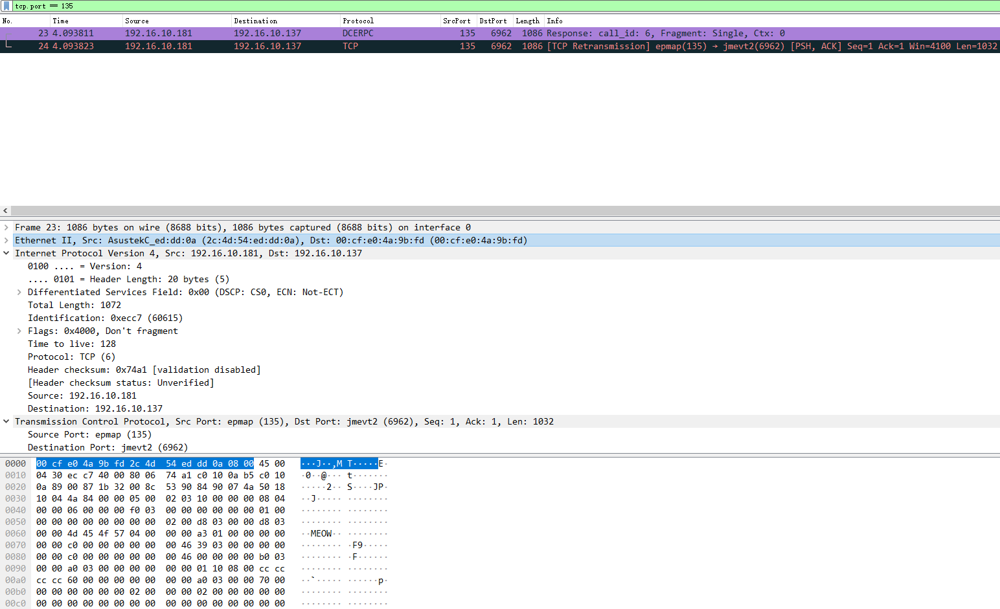

# PhonyPacket

伪造数据包的 Codeblocks 工程

目前仅封装了 常规TCP数据包的伪造 和  常规UDP数据包的伪造 功能。

需 Linux 下 libnet 库

安装该库 apt-get install libnet-dev

编译时，需配置链接参数 -lnet 。（显然，在 Windows 下配置该参数将无法编译）

## 功能：

1. 复制某常规 TCP 数据包，并发送一模一样的数据包
2. 对 PacketInfo 对象的相应字段赋值，得到自定义的数据包。

## 用法：

可以从 Wireshark 中，使用 "Copy"->"...as a Hex Stream” 功能复制一个数据包的完整的十六进制格式的数据流。

然后调用相关函数解析这个数据流（也可以修改），并发送即可。

参见 main.cpp 中的示例。

直接编译示例并运行后（编译测试环境：Ubuntu 18.04，GCC 7.4.0），抓包得到的结果如下： 

注：暂不清楚，为何 Wireshark 显示有两个包，毕竟只调用了一次 write 函数。

 